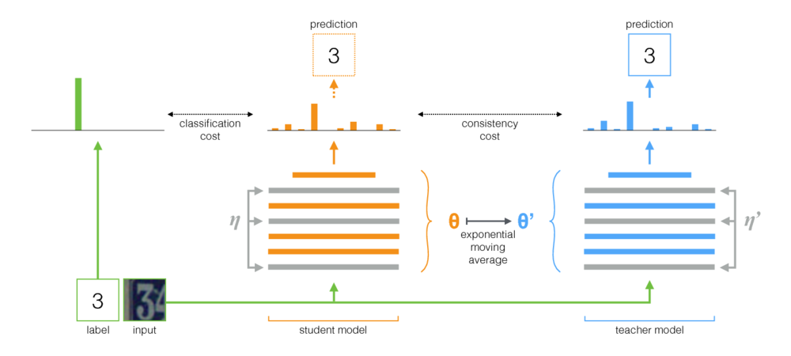

# Mean teachers are better role models

[Paper](https://arxiv.org/abs/1703.01780) ---- [NIPS 2017 poster](nips_2017_poster.pdf) ---- [NIPS 2017 spotlight slides](nips_2017_slides.pdf) ---- [Blog post](https://thecuriousaicompany.com/mean-teacher/)

By Antti Tarvainen, Harri Valpola ([The Curious AI Company](https://thecuriousaicompany.com/))

## Approach

Mean Teacher is a simple method for semi-supervised learning. It consists of the following steps:

1. Take a supervised architecture and make a copy of it. Let's call the original model the **student** and the new one the **teacher**.
2. At each training step, use the same minibatch as inputs to both the student and the teacher but add random augmentation or noise to the inputs separately.
3. Add an additional *consistency cost* between the student and teacher outputs (after softmax).
4. Let the optimizer update the student weights normally.
5. Let the teacher weights be an exponential moving average (EMA) of the student weights. That is, after each training step, update the teacher weights a little bit toward the student weights.

Our contribution is the last step. Laine and Aila [\[paper\]](https://arxiv.org/abs/1610.02242) used shared parameters between the student and the teacher, or used a temporal ensemble of teacher predictions. In comparison, Mean Teacher is more accurate and applicable to large datasets.

Mean Teacher works well with modern architectures. Combining Mean Teacher with ResNets, we improved the state of the art in semi-supervised learning on the ImageNet and CIFAR-10 datasets.

ImageNet using 10% of the labels | top-5 validation error
---------------------------------|------------------------
Variational Auto-Encoder [\[paper\]](https://arxiv.org/abs/1609.08976) | 35.42 ± 0.90
Mean Teacher ResNet-152          |  **9.11 ± 0.12**
All labels, state of the art [\[paper\]](https://arxiv.org/pdf/1709.01507.pdf) |  3.79

CIFAR-10 using 4000 labels   | test error
-----------------------------|-----------
CT-GAN [\[paper\]](https://openreview.net/forum?id=SJx9GQb0-) | 9.98 ± 0.21
Mean Teacher ResNet-26	     | **6.28 ± 0.15**
All labels, state of the art [\[paper\]](https://arxiv.org/abs/1705.07485) | 2.86

## Implementation

There are two implementations, one for TensorFlow and one for PyTorch.
The PyTorch version is probably easier to adapt to your needs,
since it follows typical PyTorch idioms, and there's a natural place to
add your model and dataset. Let me know if anything needs clarification.

Regarding the results in the paper, the experiments using a traditional
ConvNet architecture were run with the TensorFlow version.
The experiments using residual networks were run with the PyTorch version.

## Tips for choosing hyperparameters and other tuning

Mean Teacher introduces two new hyperparameters: EMA decay rate and consistency cost weight. The optimal value for each of these depends on the dataset, the model, and the composition of the minibatches. You will also need to choose how to interleave unlabeled samples and labeled samples in minibatches.

Here are some rules of thumb to get you started:

* If you are working on a new dataset, it may be easiest to start with only labeled data and do pure supervised training. Then when you are happy with the architecture and hyperparameters, add mean teacher. The same network should work well, although you may want to tune down regularization such as weight decay that you have used with small data.
* Mean Teacher needs some noise in the model to work optimally. In practice, the best noise is probably random input augmentations. Use whatever relevant augmentations you can think of: the algorithm will train the model to be invariant to them.
* It's useful to dedicate a portion of each minibatch for labeled examples. Then the supervised training signal is strong enough early on to train quickly and prevent getting stuck into uncertainty. In the PyTorch examples we have a quarter or a half of the minibatch for the labeled examples and the rest for the unlabeled. (See [TwoStreamBatchSampler](pytorch/mean_teacher/data.py#L98) in Pytorch code.)
* For EMA decay rate 0.999 seems to be a good starting point.
* You can use either MSE or KL-divergence as the consistency cost function. For KL-divergence, a good consistency cost weight is often between 1.0 and 10.0. For MSE, it seems to be between the number of classes and the number of classes squared. On small datasets we saw MSE getting better results, but KL always worked pretty well too.
* It may help to ramp up the consistency cost in the beginning over the first few epochs until the teacher network starts giving good predictions. 
* An additional trick we used in the PyTorch examples: Have two seperate logit layers at the top level. Use one for classification of labeled examples and one for predicting the teacher output. And then have an additional cost between the logits of these two predictions. The intent is the same as with the consistency cost rampup: in the beginning the teacher output may be wrong, so loosen the link between the classification prediction and the consistency cost. (See the [--logit-distance-cost](https://github.com/CuriousAI/mean-teacher/blob/master/pytorch/mean_teacher/cli.py#L65-L66) argument in the PyTorch implementation.)
